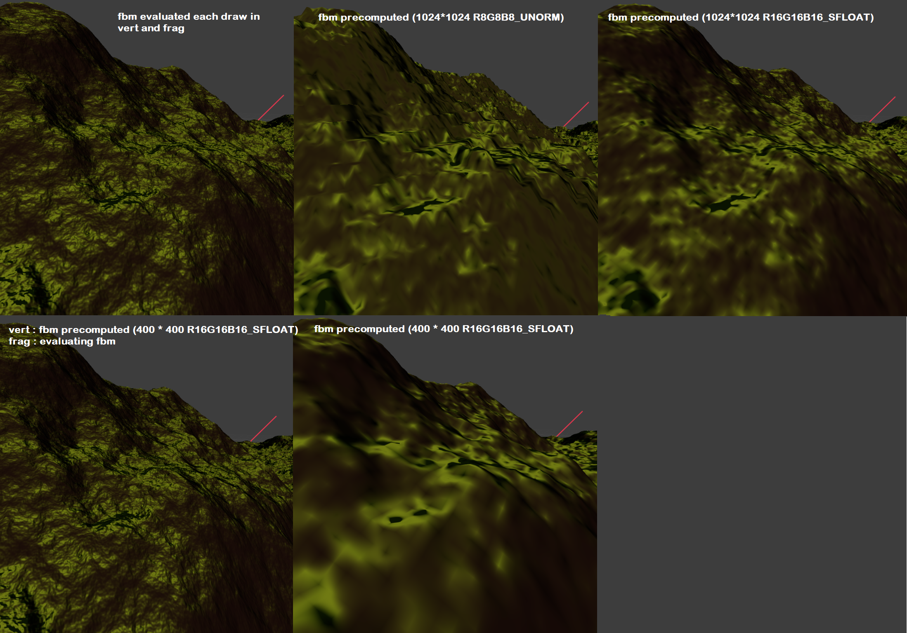
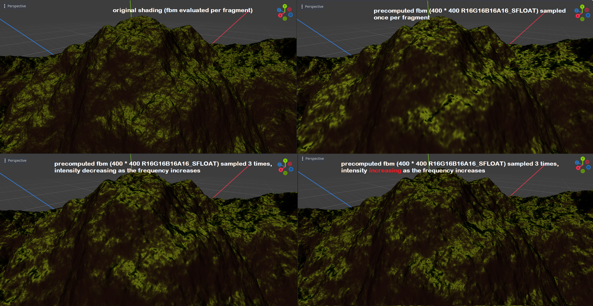
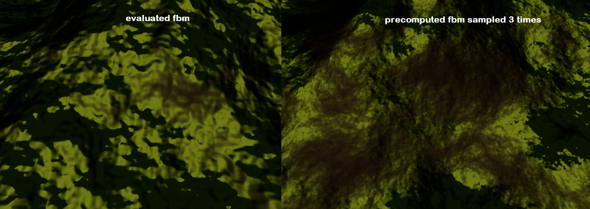

# Godot Terrain Generator

Acerola's Dirt Jam

## What's in this branch

Terrain is generated using a noise function (fbm) for vertices displacement and shading. Originally the function is evaluated in both the vertex and fragment shaders. 
This branch explores sampling the fbm once and storing the result in a texture so that the shaders can avoid re computing the values each draw

## What is there to learn

Texture size matters. Width / height must be close to the number of vertices per side, but the number of bits per channel is even more important

In the fragment shader, evaluating the fbm texture once is not enough as we are then losing the fbm details that have a frequency (period) higher than mesh size / texture width.
So it is possible to sample the fbm texture multiple times to produce higher frequency details, reproducing the approach of the fbm itself with octaves

This fbm-style sampling of the fbm texture is even giving a more rocky look to the terrain, compared to the organic / cellular look of the original method (evaluating fbm per fragment) that comes from perlin noise

---

by Acerola

Implements simple perlin noise based fractional brownian motion as a Godot compositor effect for use as a base or reference in my event [Dirt Jam](https://itch.io/jam/acerola-dirt-jam/).

## How To Use

* Create a new godot project with a 3D root node
* Add `DirectionalLight3D`, `Camera3D`, and `WorldEnvironment` nodes to the scene
* Add a `Compositor` to the `WorldEnvironment` node
* Add an element to the `Compositor Effects` array
* Instantiate a new `DrawTerrainMesh` in the element field
* Click the box to open the settings list for the terrain, hover over settings to get an explanation for what it does!
