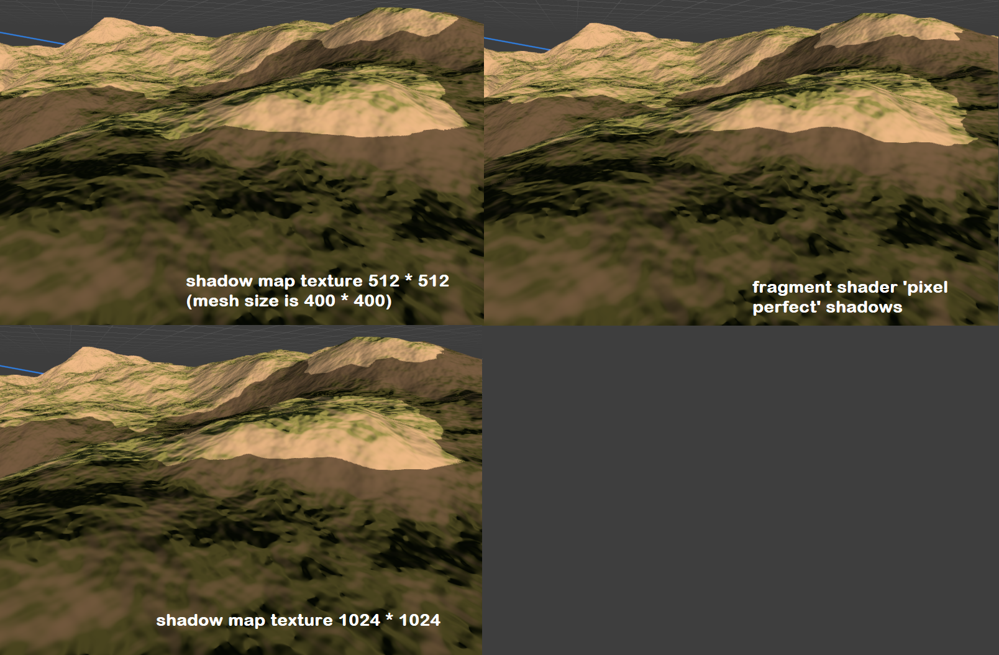
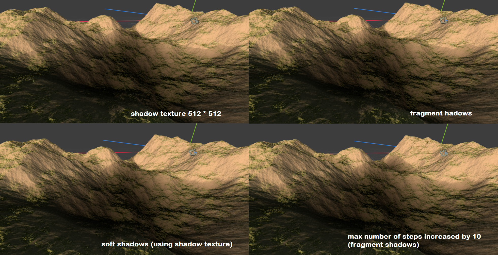
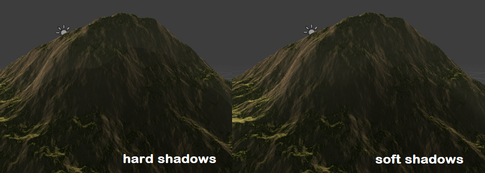

# Godot Terrain Generator

Acerola's Dirt Jam

## What's in this branch

Cast shadows or 'analytical shadows' using the noise function, either 'pixel-perfect' ie computed in the fragment shader with noise sampling, or computed once and stored in a texture using two techniques. 
The main technique, for the fragment shader and the shadow map texture is ray marching. The other shadow map technique is propagating shadow height to neighbor texels. It has poorer results and performances but was done for the sake of experiment

## What is there to learn

Fragment shadows (shadows computed in the fragment shader) give the best result when using hard shadows (distinct frontier between pixels that are in shadow / in light). The straight shadow lines caused by interpolation when using shadow map samples are most visible on flat terrain, less on bumpy surfaces

Anyway, we likely prefer having soft shadows and in this case the difference between the two techniques insn't noticeable

Shadows edges that become softer as we go further away from the object casting the shadow was not implemented but would be a nice improvement. On the contrary, we have unwanted shadow edges near the top of the shadowed faces of the terrain. 
This is caused by the soft shadow smoothstepping cutting away shadow intensity in the light shadow regions, but can be fixed using another formula that increases overall shadows instead.

---

by Acerola

Implements simple perlin noise based fractional brownian motion as a Godot compositor effect for use as a base or reference in my event [Dirt Jam](https://itch.io/jam/acerola-dirt-jam/).

## How To Use

* Create a new godot project with a 3D root node
* Add `DirectionalLight3D`, `Camera3D`, and `WorldEnvironment` nodes to the scene
* Add a `Compositor` to the `WorldEnvironment` node
* Add an element to the `Compositor Effects` array
* Instantiate a new `DrawTerrainMesh` in the element field
* Click the box to open the settings list for the terrain, hover over settings to get an explanation for what it does!
