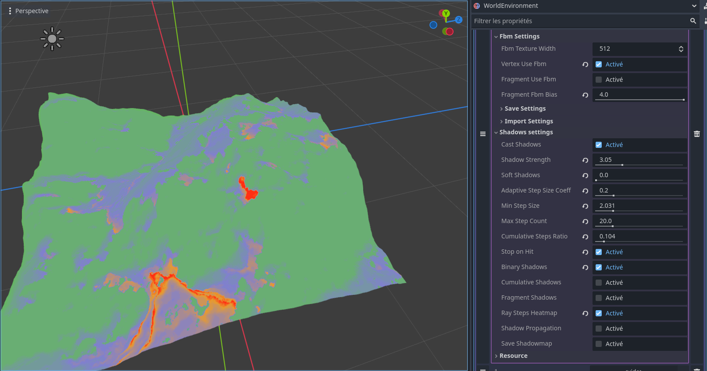
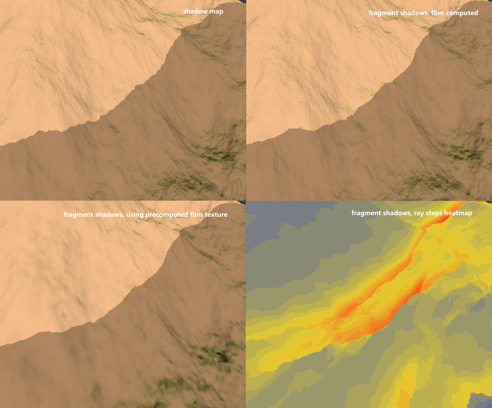
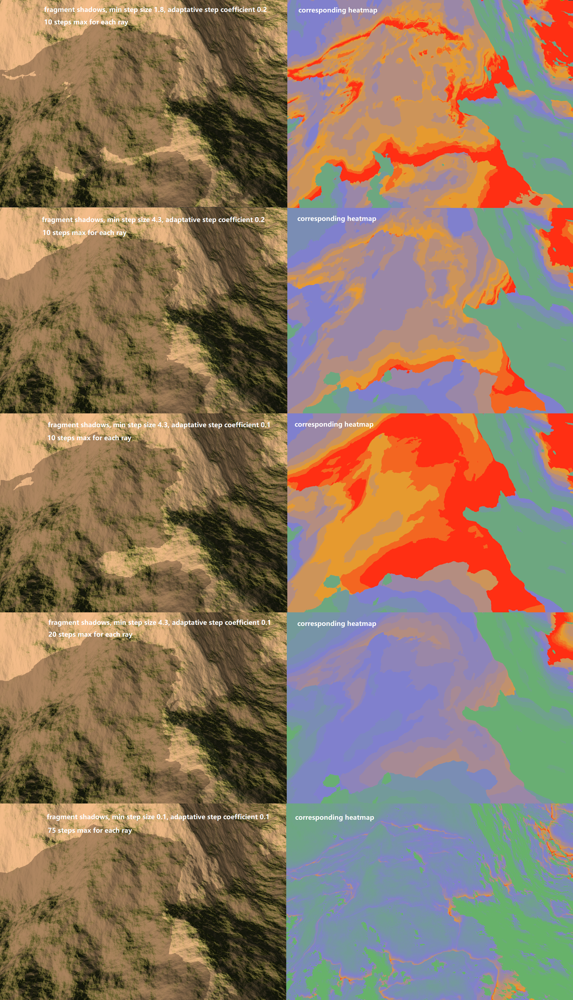
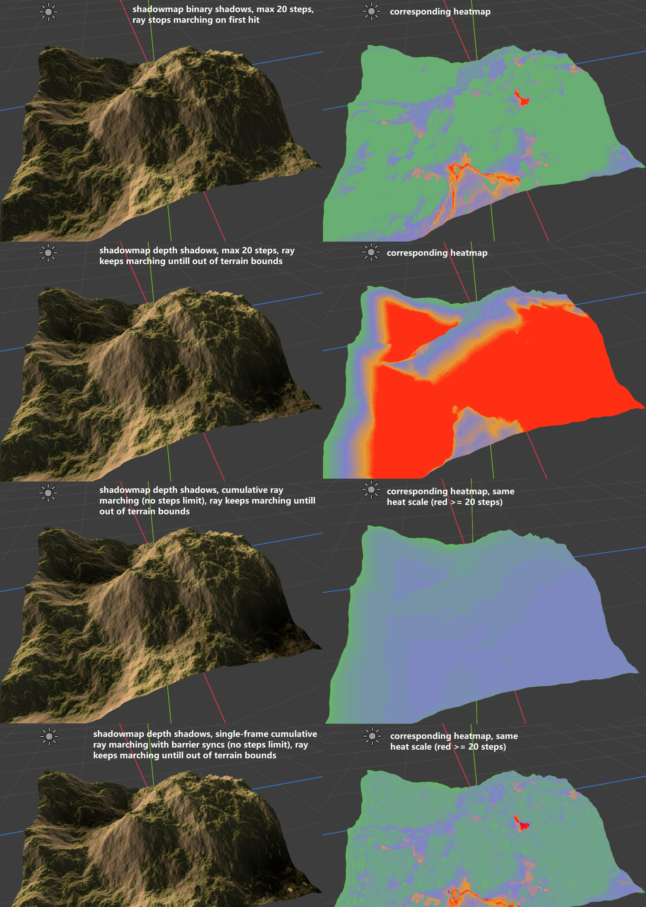
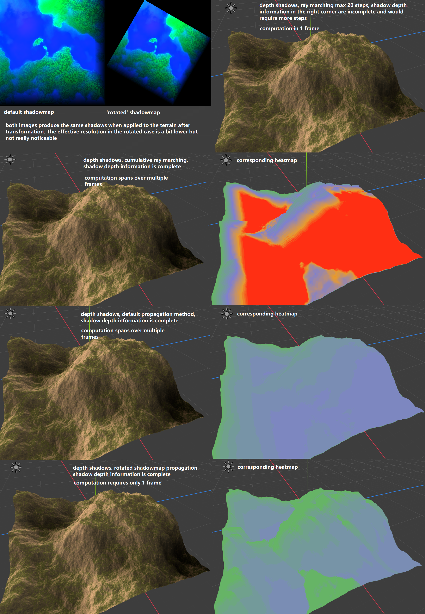
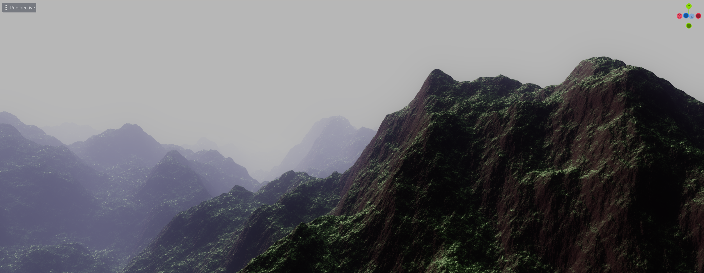

# Godot Terrain Generator

Acerola's Dirt Jam

## What's in this branch

Cast shadows or 'analytical shadows' using the noise function, either 'pixel-perfect' ie computed each frame in the fragment shader, or computed once and stored in a texture that we will call shadow map, using three techniques.

The first and **main technique is ray marching**, and is implemented for both **shadow map** and **fragment shader**. The other techniques only work with the shadow map as the result is computed over multiple frames and stored in the texels. 

The second technique is also ray marching but with slight changes that allow to span the computation across multiple frames, reusing the results of the previous frame. This allows to remove the limitation of the number of steps per ray. 

The last technique is propagating shadow height to neighbor texels. It has poorer results and performances but was done for the sake of experiment.

## What is there to learn

Fragment shadows (shadows computed in the fragment shader) give the most detailed frontier between pixels that are in shadow / in light, which we see when using hard shadows. Yet for the frontier to be **pixel-perfect**, the ray marching parameters must be so precise that the fragment shader ray marching is going to take **too much compute**.

In the image below the fragment shadows look like the terrain has overhangs which isn't the case since the terrain is a heightmap. So the shadows are incorrect.
To remove these incorrect shadows we would have to reduce the minimum size of each steps and / or the adaptative step size coefficient, which purpose is to allow for bigger steps towards the light source if we are far away from the terrain surface.
But if we do so the number of steps each ray is going to take to hit the terrain will increase and the heatmap already shows that in some areas the rays almost reached the steps limit (where there is red).

In the following image we are in poorer shadow conditions : the terrain that casts the shadow we see is further away. 
There are clear full-red regions where the rays have reached the maximum number of steps without hitting the terrain while there actually is some terrain blocking the ray's path. The image shows how the min step size, adaptive step size coefficient and maximum number of steps per ray impact the shadows presence and the precision of the light / shadow limit.

From the previous image I conclude that **accurate shadow / light frontier take way too much compute for very little gain compared to shadowmap**.
**Shadowmap**, although less precise, has the advantage of **having less artifacts like holes or overhangs in the shadow limit**, which in our case looks more realistic.

Also, for the current terrain scale, a maximum of 20 steps per ray is not enough to confidently render distant shadows. 
Though 20 max steps per ray is somwhat the limit in terms of performance, because beyond that I start having image flickering, which cause I don't know exactly but has to do with the amount of compute the fragment shader does.

Using the precomputed fbm texture in the fragment shader instead of computing the fbm directly allows to increase the maximum of steps further but we lose the pixel-perfect shadows promise that would require computing the fbm.

So I prefer to use the available compute to cast more distant shadows than to increase the definition of the shadow / light frontier. Anyway in game **the shadows will likely not be as hard, but we will have soft shadows and even depth shadows**.

**Depth shadows** is instead of having binary shadows as in the previous images, where a fragment is either in light or in shadow, for each fragment we compute the minimum distance to a non-blocked ray of light passing above. The image below shows the difference between binary and depth shadows.

For depth shadows, the ray now must **keep marching even after it hit some terrain**, because it may encounter later on a terrain that is even higher and causes a **deeper shadow**. So with depth shadows, each ray keeps marching untill it goes out of the terrain bounds, and does not stop on the first hit like it would for binary shadows.

This technique may require a large amount of steps, in particular when a fragment in a valley is blocked by two mountains, the further one being the taller one. For the ray to reach the taller mountain it will have to march over the smaller one, but since it follows it's relief the adaptative stepping give only small steps.

To overcome this and remove the steps limit, we can ray march multiple times, each time using the previous results (referred as cumulative ray marching in the code). Since the ray length and shadow depths is stored in each texel, each successive raymarching can take **larger and larger steps** as the texels encountered will tell how far the shadow is or isn't from the current position. 

**This technique is computationally more efficient but requires scheduling the raymarching compute shader multiple times**.

One possibility is to schedule the ray marching once per frame. The result produced can be seen in the third row of the image above. The shadows are accurate but we see some square artifacts in the heatmap. These artifacts are caused by the compute shader thread groups reading shadowmap data from other thread groups (thus without being synchronized). This does not have a negative impact on the shadows, but can slightly increase or decrease the number of steps that the current thread group will take to reach the terrain bounds, which we see in the heatmap.

The problem with scheduling ray marching each step is when we update the lighting we will need multiple frames untill the shadows are accurate. If we use the rotate light source toggle then the shadows will disappear because each frame the lighting changes thus the cumulative ray marching starts from scratch and the results do not have enough steps to produce shadows.

To counter this we can try to accumulate multiple ray marching in one frame using barrier syncs. Yet as it is each thread group samples texels from other groups so we will encounter the same problem. This time this affects negatively the shadows as shows the last row of the image above. To fix this we could rotate the shadowmap so that one direction is aligned with the light direction, and use thread groups that cover the entire span of the map in this direction (ie x=512, y=1, z=1).

This is what the rotated shadowmap propagation technique is, as showed in picture above.

The technique requires only log2(shadowmap_height) steps, which is the lowest number across all techniques. Also each step is computationally very cheap, it is 1 read, comparison and write back into a cache array. Each step has to be synchronized so that the read and write occur in the correct odrder across all threads of the same group, each group being dedicated to 1 column of the shadowmap as the y axis is aligned with the light direction.

I'm assuming this is the most optimized technique of all, but is less scalable than basic fragment shader ray marching for example.

---

by Acerola

Implements simple perlin noise based fractional brownian motion as a Godot compositor effect for use as a base or reference in my event [Dirt Jam](https://itch.io/jam/acerola-dirt-jam/).

## How To Use

* Create a new godot project with a 3D root node
* Add `DirectionalLight3D`, `Camera3D`, and `WorldEnvironment` nodes to the scene
* Add a `Compositor` to the `WorldEnvironment` node
* Add an element to the `Compositor Effects` array
* Instantiate a new `DrawTerrainMesh` in the element field
* Click the box to open the settings list for the terrain, hover over settings to get an explanation for what it does!
